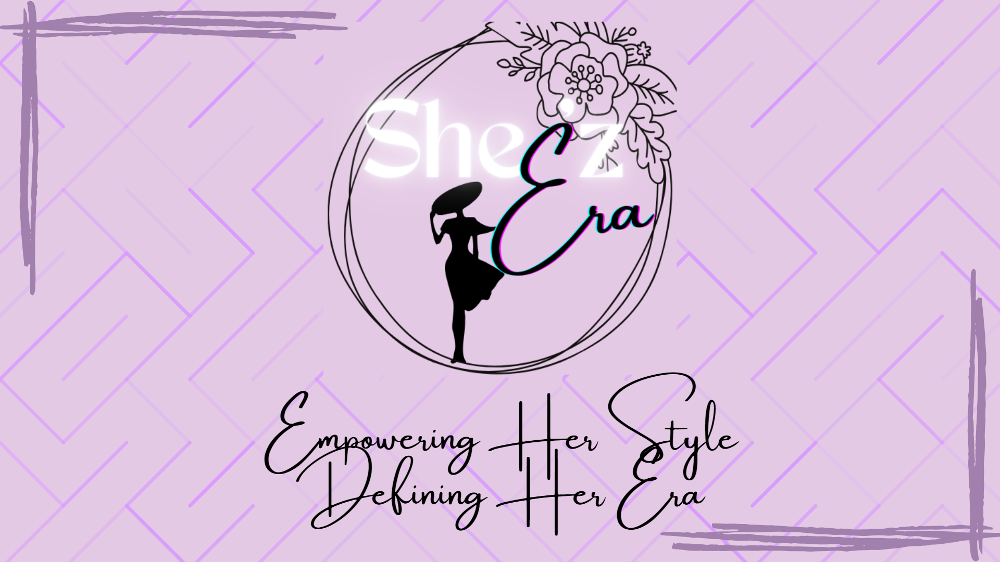

# Shee'z Era Pitch Deck

## Introduction
Shee'z Era is a conceptual online store offering affordable, aesthetic products inspired by Korean trends. The brand aims to bring trendy and high-quality items, especially for women, at accessible prices. This pitch deck demonstrates the branding, unique selling points, and design vision for Shee'z Era.

---

## Repository Contents
- **pitch-deck.pdf**: The complete pitch deck in PDF format.
- **images/**: Individual pages of the pitch deck in PNG format:
  - Cover Page
  - About & USP Page
- **assets/**: Additional resources such as the brand logo and color palette.

---

## Tools Used
- **Canva**: For designing the pitch deck.
- **GitHub**: For version control and documentation.
- **Design Skills**: Branding, layout design, and visual storytelling.

---

## Visual Previews

### Logo

### Cover Page

### About & USP Page

---

## About Shee'z Era
At Shee'z Era, we believe every woman deserves to embrace her unique style without compromising on affordability. Inspired by Korean trends, our curated collection includes scrunchies, claw clips, bottles, and BTS-themed merchandise, bringing everyday elegance to women everywhere.

### Unique Selling Points
- **Affordable Elegance**: Premium designs at accessible prices.
- **Curated for Women**: Products reflecting modern femininity and charm.
- **Trendy and Instagram-worthy**: A collection inspired by the latest Korean aesthetics.

---

## How to Access
- **View the full pitch deck**: [Download PDF](pitch-deck.pdf)

---
